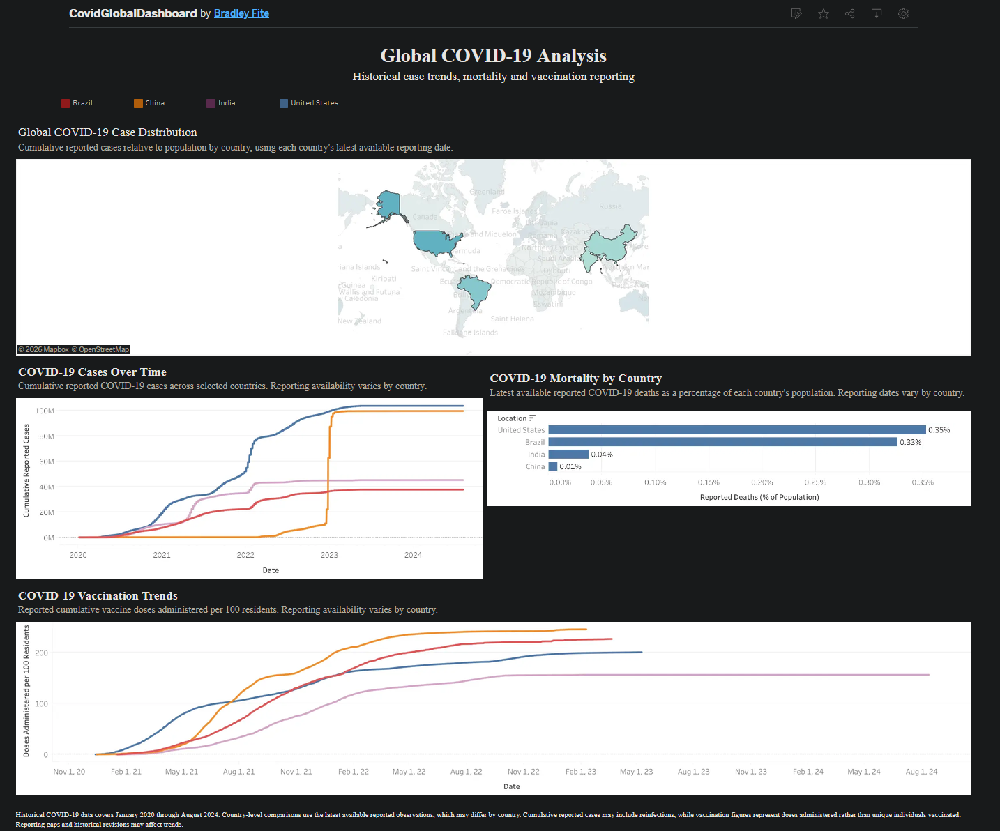

# COVID-19 Global Data Analysis

### End-to-End Data Analytics & Business Intelligence Portfolio Project

An end-to-end data analytics project exploring global COVID-19 infections, mortality, and vaccination trends using **Python, Microsoft SQL Server, T-SQL, and Tableau**.

The project demonstrates a complete analytical workflow: downloading and validating source data, ingesting it into SQL Server, investigating data-quality issues, transforming and validating analytical datasets, creating reusable dashboard views, and presenting the results through an interactive Tableau dashboard.

## Interactive Dashboard

**[View the Global COVID-19 Dashboard on Tableau Public](https://public.tableau.com/views/CovidGlobalDashboard_17909901692770/GlobalCOVID-19Dashboard)**



---

## Project Overview

The objective of this project was to transform historical COVID-19 data into a reproducible and validated analytical workflow suitable for business intelligence and exploratory analysis.

The project focuses on three primary questions:

1. How did reported COVID-19 cases change over time across countries?
2. How do reported infections and mortality compare relative to population?
3. How did reported COVID-19 vaccination activity develop over time?

Rather than connecting Tableau directly to the original CSV, the project separates responsibilities across multiple layers:

- **Python** handles source-data acquisition, validation, ingestion, and pipeline orchestration.
- **SQL Server** handles staging, cleaning, transformations, analytics, assertions, and reusable views.
- **Tableau** consumes validated analytical views and presents the results through an interactive dashboard.

### Project Highlights

- Automated source-data downloading and structural validation.
- Imported **429,435 historical records** into SQL Server.
- Investigated and consolidated **7,770 complementary duplicate record groups**.
- Produced a cleaned analytical dataset containing **421,665 records**.
- Developed reusable analytical tables and Tableau-ready SQL views.
- Added automated SQL assertions that stop the pipeline when integrity checks fail.
- Identified significant gaps in daily vaccination reporting.
- Built a one-command end-to-end data pipeline.
- Completed a full automated rebuild in **under 50 seconds** on the development environment.
- Published an interactive Tableau Public dashboard.

---

## Technologies & Skills

| Technology | Application |
|---|---|
| Python | Data acquisition, ingestion, validation, automation, and orchestration |
| pandas | Chunked CSV processing and data-type conversion |
| pyodbc | Python connectivity to Microsoft SQL Server |
| pathlib | Cross-platform project and file-path management |
| hashlib | SHA-256 dataset integrity verification |
| argparse | Command-line pipeline modes and safeguards |
| Microsoft SQL Server | Relational storage, transformation, and analytical processing |
| T-SQL | Data cleaning, joins, CTEs, window functions, assertions, aggregations, and views |
| Tableau | Interactive business intelligence dashboard |
| Git & GitHub | Version control, documentation, and project presentation |
| ChatGPT | AI-assisted development, troubleshooting, review, and documentation |

**Key skills demonstrated:** ETL development, data-quality investigation, SQL analytics, data modeling, automated validation, pipeline orchestration, dependency management, data visualization, reproducibility, and AI-assisted development.

---

## Data Source

The project uses historical COVID-19 data published by **Our World in Data**.

**Source repository:**  
[Our World in Data — COVID-19 Data](https://github.com/owid/covid-19-data)

The automated downloader retrieves:

```text
https://raw.githubusercontent.com/owid/covid-19-data/master/public/data/owid-covid-data.csv
```

### Historical Dataset Used During Development

| Metric | Value |
|---|---:|
| Records | 429,435 |
| Distinct locations | 255 |
| Earliest date | 2020-01-01 |
| Latest date | 2024-08-14 |

### SHA-256 Checksum

The historical CSV used during development produced the following SHA-256 checksum:

```text
8473D0F0FDF962E1FFBD5B85B18726FC96A49BAB109E271186C339725A12B10C
```

The downloader calculates and reports the SHA-256 hash of downloaded source data, allowing future downloads to be compared against the development dataset.

A matching hash verifies that the file contents are identical to the reference file. It does not independently verify the accuracy of the underlying COVID-19 statistics.

### Reproducibility Note

The downloader currently retrieves the file from the upstream repository's `master` branch.

If the upstream file changes in the future, record counts and results may differ. The checksum above documents the exact file contents used during this project's development.

The source CSV is excluded from Git version control.

---

## Data Architecture

```text
          Our World in Data
          Historical CSV
                 |
                 v
       scripts/download_covid.py
        Download + Validation
        SHA-256 Calculation
                 |
                 v
       scripts/import_covid.py
       pandas + pyodbc ETL
                 |
                 v
       staging.CovidRaw
                 |
                 v
     Data Quality Investigation
     Duplicate / Conflict Checks
                 |
                 v
    01_clean_staging_data.sql
                 |
                 v
       staging.CovidClean
                 |
                 v
  02_create_analytical_tables.sql
          /              \
         v                v
 dbo.CovidDeaths   dbo.CovidVaccinations
          \              /
           \            /
            v          v
       SQL Analysis Layer
                 |
                 v
   Automated Data Assertions
  09_assert_data_quality.sql
                 |
                 v
   Tableau-Ready SQL Views
 07_create_dashboard_views.sql
                 |
                 v
 Automated Dashboard Assertions
10_assert_dashboard_views.sql
                 |
                 v
          Tableau Extracts
                 |
                 v
      Interactive Dashboard
                 |
                 v
          Tableau Public
```

---

## Python Pipeline Components

### `download_covid.py`

Downloads the Our World in Data CSV directly into the project's `data` directory.

The script:

- Downloads to a temporary file first.
- Verifies that required columns exist.
- Avoids replacing the existing CSV unless validation succeeds.
- Calculates the SHA-256 checksum.
- Stores the final file as:

```text
data/owid-covid-data.csv
```

### `import_covid.py`

Loads the downloaded CSV into SQL Server.

The ingestion process:

- Reads the CSV in chunks.
- Imports only the fields required by the analysis.
- Validates date conversions.
- Validates numeric values without silently coercing unexpected text.
- Preserves missing values as SQL `NULL`.
- Uses batch inserts through `pyodbc`.
- Rebuilds `staging.CovidRaw`.

### `db_connection.py`

Centralizes SQL Server connectivity for the project.

It:

- Reads the SQL Server instance from the `COVID_SQL_SERVER` environment variable.
- Detects Microsoft ODBC Driver 18 or 17.
- Uses Windows Authentication.
- Supports connections to different databases.
- Allows transaction behavior to be configured through `autocommit`.

### `sql_runner.py`

Executes SQL files from Python.

The utility:

- Reads SQL scripts from disk.
- Splits scripts on standalone SQL Server `GO` batch separators.
- Executes batches sequentially.
- Commits successful transformations.
- Rolls back uncommitted work when execution fails.
- Raises errors so the main pipeline can stop immediately.

### `run_pipeline.py`

Coordinates the complete project workflow.

It provides two execution modes:

```text
validate
full
```

`validate` runs read-only automated assertions against the existing database.

`full` downloads the source dataset, initializes the database, reloads staging data, performs transformations, validates the analytical layer, recreates Tableau-ready views, and validates those views.

The full mode requires an explicit confirmation flag to protect against accidental data replacement.

---

## SQL Data Model

The database separates raw source data, cleaned staging data, analytical tables, and dashboard views.

| Object | Purpose |
|---|---|
| `staging.CovidRaw` | Raw imported source records |
| `staging.CovidClean` | Cleaned and consolidated records |
| `dbo.CovidDeaths` | Population, case, and mortality analytical data |
| `dbo.CovidVaccinations` | Daily and cumulative vaccination analytical data |
| `dbo.vw_CovidCountryDaily` | Historical country-level dashboard metrics |
| `dbo.vw_CovidCountryLatest` | Latest available country-level metrics |
| `dbo.vw_CovidVaccinationTrends` | Vaccination trends and doses per 100 residents |

---

## Data Cleaning

Initial validation revealed duplicate records sharing the same country and reporting date.

Further investigation identified **7,770 duplicate groups**.

The duplicate records were not exact duplicates. In many cases, one record contained measurements that were missing from another record with the same country/date key.

Before implementing a cleaning strategy, duplicate groups were checked for conflicting non-null measurements.

No conflicting non-null numeric values were identified among the imported metrics.

The cleaning transformation therefore groups records by:

```text
iso_code
location
date
```

and consolidates complementary values using SQL aggregation.

Missing values remain `NULL` when no source record contains the measurement.

### Cleaning Results

| Metric | Count |
|---|---:|
| Raw records | 429,435 |
| Duplicate groups consolidated | 7,770 |
| Cleaned records | 421,665 |

The original raw staging data remains separate from the cleaned dataset.

---

## SQL Analysis

Dedicated SQL scripts explore infections, mortality, and vaccination activity.

### Infection Analysis

Reported cumulative cases relative to population are calculated as:

```text
(Cumulative Reported Cases / Population) × 100
```

`ROW_NUMBER()` is used to identify each country's latest available cumulative case observation.

This avoids assuming that all countries reported through the same final date.

**Limitation:** Cumulative cases may include repeat infections and therefore do not represent unique individuals infected.

### Mortality Analysis

Two distinct mortality metrics are analyzed.

#### Reported Case Fatality Ratio

```text
(Cumulative Reported Deaths / Cumulative Reported Cases) × 100
```

#### Reported Deaths Relative to Population

```text
(Cumulative Reported Deaths / Population) × 100
```

These metrics answer different questions and are intentionally treated separately.

`NULLIF()` is used to protect calculations from division-by-zero errors.

Zero deaths are retained as legitimate observations rather than treated as missing data.

### Vaccination Analysis

SQL window functions calculate running totals from available daily vaccination observations.

Those calculated totals are compared with the source's reported cumulative vaccination totals.

This analysis identified significant gaps in daily vaccination reporting.

The dashboard therefore uses reported cumulative vaccination totals rather than attempting to reconstruct cumulative totals from incomplete daily observations.

The dashboard metric is:

```text
(Cumulative Vaccine Doses Administered / Population) × 100
```

This represents **reported vaccine doses administered per 100 residents**.

It does not represent the percentage of unique individuals vaccinated.

---

## Vaccination Reporting Completeness

A dedicated completeness analysis produced the following results:

| Metric | Result |
|---|---:|
| Countries and territories with cumulative vaccination data | 223 |
| Observations with reported cumulative vaccination totals | 70,150 |
| Observations missing corresponding daily vaccination values | 14,403 |
| Missing daily observation rate | 20.53% |

Approximately **20.53% of observations containing cumulative vaccination totals lacked corresponding daily vaccination measurements**.

This is an observation-level missing-data rate, not the percentage of countries affected.

This finding directly influenced the dashboard's metric design.

---

## Automated SQL Assertions

The project includes automated SQL assertions that raise SQL Server errors when data-quality expectations fail.

### Analytical Assertions

`09_assert_data_quality.sql` validates:

- The cleaned staging dataset is not empty.
- Cleaned country/date identifiers are unique.
- Analytical table record counts match cleaned staging.
- Required analytical identifiers are populated.
- Analytical-table keys are unique.
- Analytical tables contain the same expected keys as cleaned staging.
- Case, mortality, and population measurements match cleaned staging.
- Vaccination measurements match cleaned staging.

The assertion suite completes in approximately **12 seconds** on the development environment.

### Dashboard View Assertions

`10_assert_dashboard_views.sql` validates:

- Historical dashboard views expose the expected record counts.
- The latest-country view contains one record per ISO code.

Assertions use SQL Server `THROW` statements so failures propagate back to Python and stop the automated pipeline.

This converts manual data-quality inspection into pipeline-level automated testing.

---

## Tableau Dashboard

**[Open the Interactive Tableau Dashboard](https://public.tableau.com/views/CovidGlobalDashboard_17909901692770/GlobalCOVID-19Dashboard)**


The dashboard contains four primary visualizations.

### Global COVID-19 Case Distribution

Interactive geographic visualization of cumulative reported cases relative to population.

The map also functions as a country-selection control for the other dashboard visualizations.

### COVID-19 Cases Over Time

Historical line chart comparing cumulative reported cases across selected countries.

### COVID-19 Mortality by Country

Horizontal bar chart comparing cumulative reported deaths relative to population.

Latest available reporting dates may differ between countries.

### COVID-19 Vaccination Trends

Historical line chart comparing reported cumulative vaccine doses administered per 100 residents.

Reported cumulative totals are used because daily vaccination reporting is incomplete.

### Packaged Tableau Workbook

The packaged workbook is included in the repository:

```text
visualizations/CovidGlobalDashboard.twbx
```

The workbook contains Tableau extracts and was tested successfully without an active connection to the original local SQL Server instance.

---

## Project Structure

```text
CovidDataExplorationProject/
│
├── data/
│
├── docs/
│
├── scripts/
│   ├── db_connection.py
│   ├── download_covid.py
│   ├── import_covid.py
│   ├── run_pipeline.py
│   ├── sql_runner.py
│   └── test_sql_runner.py
│
├── sql/
│   ├── 00_database_setup.sql
│   ├── 01_clean_staging_data.sql
│   ├── 02_create_analytical_tables.sql
│   ├── 03_validate_analytical_tables.sql
│   ├── 04_infection_analysis.sql
│   ├── 05_mortality_analysis.sql
│   ├── 06_vaccination_analysis.sql
│   ├── 07_create_dashboard_views.sql
│   ├── 08_validate_dashboard_views.sql
│   ├── 09_assert_data_quality.sql
│   ├── 10_assert_dashboard_views.sql
│   ├── 11_test_connection.sql
│   └── original_analysis.sql
│
├── visualizations/
│   ├── CovidGlobalDashboard.twbx
│   └── dashboard_preview.png
│
├── requirements.txt
├── .gitignore
└── README.md
```

The original exploratory SQL is retained separately to document the project's evolution.

---

# Running the Project Locally

## Prerequisites

The automated pipeline requires:

- Python 3
- Microsoft SQL Server
- Microsoft ODBC Driver 17 or 18 for SQL Server
- Windows Authentication access to SQL Server
- Permission to create the `CovidPortfolioProject` database
- Permission to create, drop, and modify database objects
- Internet access for downloading the source CSV

Tableau Desktop is only required if modifying the workbook.

---

## 1. Clone the Repository

```powershell
git clone https://github.com/bfite3/CovidDataExplorationProject.git
cd CovidDataExplorationProject
```

---

## 2. Create a Python Virtual Environment

```powershell
python -m venv .venv
```

Activate the environment:

```powershell
.\.venv\Scripts\Activate.ps1
```

Install dependencies:

```powershell
python -m pip install -r requirements.txt
```

The project currently requires:

```text
pandas>=2.0,<3.0
pyodbc>=5.0,<6.0
```

The Microsoft ODBC Driver is a system dependency and is not installed through `requirements.txt`.

---

## 3. Configure SQL Server

The pipeline reads the SQL Server instance from the `COVID_SQL_SERVER` environment variable.

### SQL Server Express Example

```powershell
$env:COVID_SQL_SERVER = "YOUR_COMPUTER_NAME\SQLEXPRESS"
```

Example:

```powershell
$env:COVID_SQL_SERVER = "DESKTOP-ABC123\SQLEXPRESS"
```

If using a default SQL Server instance rather than SQL Server Express, the value may simply be:

```powershell
$env:COVID_SQL_SERVER = "DESKTOP-ABC123"
```

### Environment Variable Requirements

For this configuration to work:

- SQL Server must be installed and running.
- The specified SQL Server instance must be reachable.
- Windows Authentication must be enabled.
- The current Windows user must be authorized to connect.
- Microsoft ODBC Driver 17 or 18 for SQL Server must be installed.
- The current user must have permission to create the project database and modify its objects.

The project currently uses:

```text
Trusted_Connection=yes
```

and therefore assumes **Windows Authentication** rather than SQL Server username/password authentication.

### Verify the Environment Variable

```powershell
$env:COVID_SQL_SERVER
```

The value is set only for the current PowerShell session.

If a new terminal is opened, configure it again before running the pipeline.

---

## 4. Run Validation Only

To validate the existing database without modifying pipeline data:

```powershell
python scripts/run_pipeline.py --mode validate
```

This executes:

```text
09_assert_data_quality.sql
10_assert_dashboard_views.sql
```

The pipeline reports PASS/FAIL status and execution time for each stage.

---

## 5. Run the Full Pipeline

The full pipeline rebuilds the project from the source dataset.

Because this replaces existing staging and analytical data, an explicit confirmation flag is required.

```powershell
python scripts/run_pipeline.py --mode full --confirm-rebuild
```

Running:

```powershell
python scripts/run_pipeline.py --mode full
```

without `--confirm-rebuild` intentionally fails before modifying data.

### Full Pipeline Execution Order

```text
download_covid.py
        |
        v
00_database_setup.sql
        |
        v
import_covid.py
        |
        v
01_clean_staging_data.sql
        |
        v
02_create_analytical_tables.sql
        |
        v
09_assert_data_quality.sql
        |
        v
07_create_dashboard_views.sql
        |
        v
10_assert_dashboard_views.sql
```

The exploratory analysis scripts are not required to build the Tableau datasets and therefore are not executed as part of the automated transformation pipeline.

The manual validation scripts remain available for detailed inspection, while the assertion scripts provide automated pass/fail validation.

### Pipeline Performance

On the development environment, the complete end-to-end rebuild successfully completed in:

```text
< 50 seconds
```

Actual execution time will vary by hardware, SQL Server configuration, network speed, and source-data size.

---

## Manual Analytical Scripts

The following SQL scripts remain available for exploration and detailed inspection:

| Script | Purpose |
|---|---|
| `03_validate_analytical_tables.sql` | Manually inspect analytical-table integrity |
| `04_infection_analysis.sql` | Explore infection metrics |
| `05_mortality_analysis.sql` | Explore mortality metrics |
| `06_vaccination_analysis.sql` | Investigate vaccination trends and reporting completeness |
| `08_validate_dashboard_views.sql` | Manually inspect dashboard views |

These complement the automated assertions by providing detailed result sets for human review.

---

## Analytical Limitations

The dashboard and SQL analysis should be interpreted within the limitations of the source data.

### Reporting Dates

Countries do not necessarily report through identical final dates.

### Reported Cases

Cumulative reported cases may include repeat infections and do not represent unique individuals infected.

### Mortality

Reported case fatality ratios are influenced by case detection, reporting practices, and differences in timing between infections and deaths.

Reported case fatality ratios are not equivalent to infection fatality rates.

### Vaccination Data

Vaccination totals represent administered doses, not unique vaccinated individuals.

Daily vaccination observations contain significant reporting gaps.

### Missing Values

Missing observations are preserved as `NULL` rather than automatically replaced with zero.

### Historical Scope

This project represents the historical dataset imported during development and should not be interpreted as a live COVID-19 monitoring system.

---

## Development Approach & AI Assistance

This project was developed with assistance from **ChatGPT** as an AI-powered development and learning tool.

AI assistance was used to:

- Explore implementation approaches.
- Troubleshoot Python, SQL Server, and Tableau issues.
- Review analytical logic.
- Investigate performance problems.
- Improve project documentation.
- Accelerate repetitive development tasks.

AI-generated suggestions were not treated as automatically correct.

SQL validation queries, automated assertions, source-data investigation, performance testing, and Tableau validation were used to evaluate proposed solutions.

Examples include:

- Investigating **7,770 duplicate record groups** before implementing data consolidation.
- Identifying incomplete daily vaccination reporting before selecting dashboard metrics.
- Replacing inefficient correlated SQL assertions with faster set-based comparisons.
- Diagnosing Tableau aggregation issues when cumulative values were incorrectly summed.
- Testing the packaged Tableau workbook without SQL Server connectivity.
- Building explicit safeguards around destructive pipeline execution.

The project demonstrates an approach to AI-assisted development in which AI is used to improve productivity while technical decisions remain subject to testing, validation, and review.

---

## Key Takeaways

This project demonstrates that reliable analytics requires more than writing SQL queries or creating visualizations.

The most important development lessons included:

- Investigating unexpected data before choosing a cleaning strategy.
- Preserving the distinction between zero and missing values.
- Separating raw, cleaned, analytical, and presentation layers.
- Designing reusable SQL views for BI tools.
- Automating validation instead of relying exclusively on manual inspection.
- Building pipeline safeguards around destructive operations.
- Managing Python dependencies and environment-specific configuration.
- Measuring and improving query performance.
- Documenting analytical limitations alongside results.
- Using AI to accelerate development while independently validating technical outcomes.

The completed project combines **Python ETL development, SQL Server transformation, automated data-quality testing, analytical modeling, Tableau visualization, pipeline orchestration, and reproducible project documentation** into a single end-to-end portfolio project.